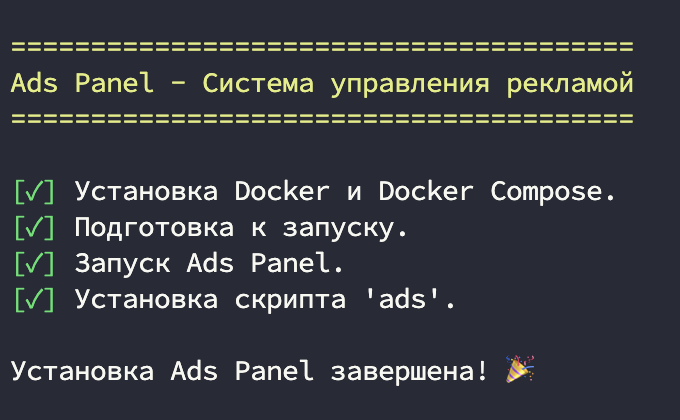
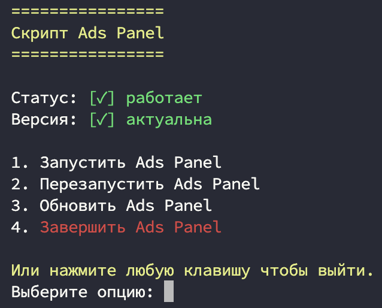
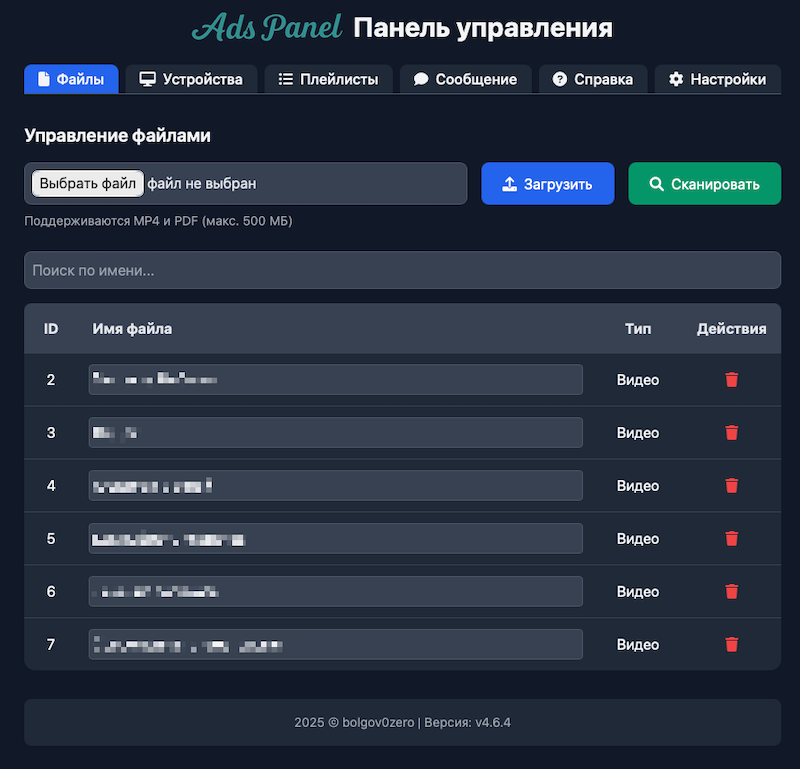
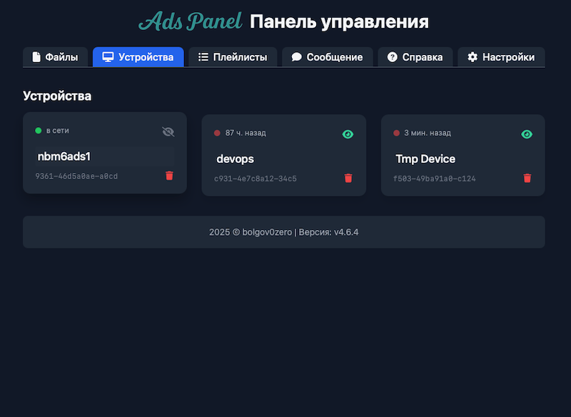
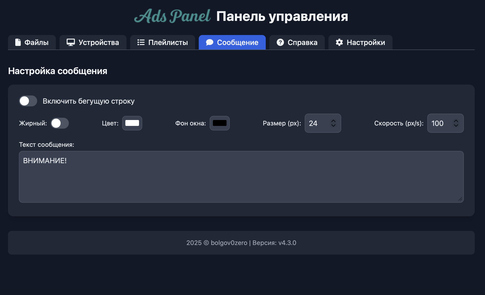

Ads Panel — это веб-панель для управления трансляцией рекламы в локальной сети. Есть поддержка видео в формате mp4 и файлов pdf.
Удобное управление клиентскими устройствами, индивидуальные плейлисты для каждого устройства и бегущая строка.
Есть система авторизации.


# Установка

Установить можно как через скрипт, так и вручную через Docker-Compose.

## 1. Скрипт:
 ```bash
 bash <(wget -qO- https://raw.githubusercontent.com/bolgov0zero/ads-panel/refs/heads/main/ads-install.sh)
 ```
Скрипт установит Docker/Docker compose, установит саму панель и скрипт ads, для удобного управление панелью(запуск, перезапуск, обновление, завершение).

  

## 2. Ручная установка(без скрипта ads):

 - Создаем файл docker-compose.yml
 ```bash
 mkdir ads && cd ads && nano docker-compose.yml
```


- Вставляем код
```bash
services:
  web:
    image: bolgov0zero/ads-panel:latest
    container_name: ads-panel
    ports:
      - "80:80"
      - "443:443"
      - "8443:443"
  volumes:
    - file_storage:/opt/ads
    - db_data:/data
    - ssl:/etc/apache2/ssl
  environment:
    - PHP_UPLOAD_MAX_FILESIZE=500M
    - PHP_POST_MAX_SIZE=500M

volumes:
file_storage:
db_data:
ssl:
```

- Запускаем
```bash
mkdir ads && cd ads && nano docker-compose.yml
```

# Скриншоты








